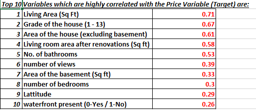
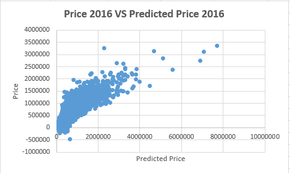
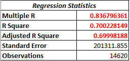
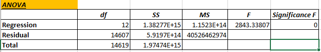
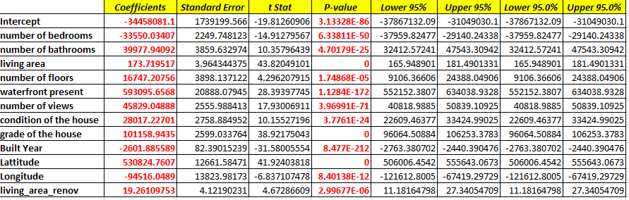
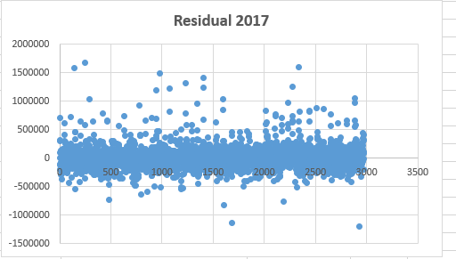

# Prediction-of-House-Price-using-Excel

In this project, we are going to look at a number of houses sold in the year 2016 and 2017 in a fictional state by a well-known real estate agency. The agency have trained auditors who measure and map all the relevant features for the properties along with information related to the geography around it. The agency wants to understand the relevance of the parameters that they collect in relation to the price of the house. They have hired you to create a model which makes use of the available information to predict the monetary value of a house. 

You are expected to use the data of the year 2016 to create a regression model where the price is the dependent variable. Identify the factors that are the driving factors for house prices. Using the model, you are expected to predict the selling prices of the houses sold in 2017.

**Tasks:**

- Create an excel report that contains all the meaningful information such as relevant charts, pivot tables etc.
- Create a few hypothesis around the important variables and validate them using the data
- Mention all the variable which are highly correlated.

Fig: Top 10 Variables which are highly correlated with the Price Variable (Target) 

- Build a linear regression model on the data of year 2016. Predict the price for year 2016 using this regression model, plot the regressed values against the actual values to understand the difference.
 

Fig: Plotting the Regressed Values against the Actual Values to understand the difference.

**Summary**

- Using the above linear regression model, predict the prices of the houses sold in the year 2017. Interpret your findings from the model.

Fig: Plotting the Residuals (Actual Value – Predicted Value) to understand the difference.

**Important Findings**
1. There are 26 cases in which the price predicted is coming out to be negative.
2. The data is approximately 70% explained by the variables.
3. We can observe that a lot of residuals are near 0 while some are far above and some are far below the 0 mark.
4. Further examination needs to be done as to determine why some predictions are coming out to be negative.
5. Regularization needs to be done because there is one variable (living_area) which has the highest influence on the model, so its effect needs to be piped down to make the
model more accurate and less biased.
